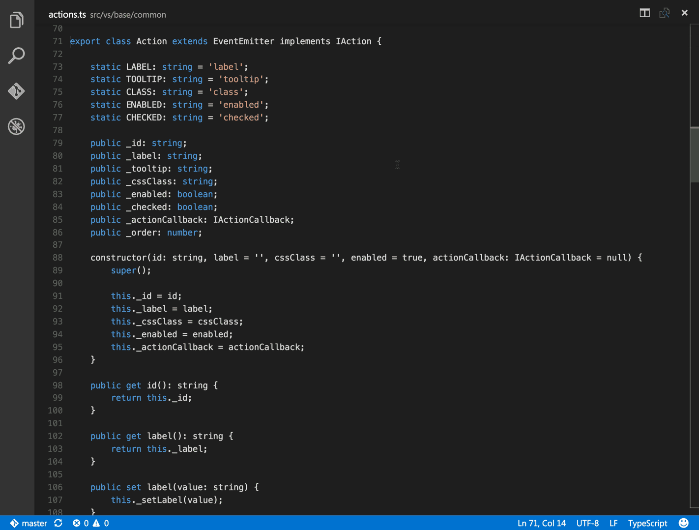

# vscode 主题和插件推荐

为使编辑器看起来更美观，丰富编辑器的功能，可以根据自己喜好选择以下推荐的主题和插件。

## 主题

- 主题颜色：[One Dark Pro](https://marketplace.visualstudio.com/items?itemName=zhuangtongfa.Material-theme)

  

- 主题图标：[Material Icon Theme](https://marketplace.visualstudio.com/items?itemName=PKief.material-icon-theme)

  

- 配置方法：

```json
{
  "workbench.colorTheme": "One Dark Pro",
  "workbench.iconTheme": "material-icon-theme"
}
```

## 插件

- [Auto Rename Tag](https://marketplace.visualstudio.com/items?itemName=formulahendry.auto-rename-tag) - 自动重命名配对的 HTML/XML 标记。

  

- [Code Runner](https://marketplace.visualstudio.com/items?itemName=formulahendry.code-runner) - 运行代码或文件，支持多语言。
  
  

- [Document This](https://marketplace.visualstudio.com/items?itemName=joelday.docthis) - 一款自动生成详细注释的工具，支持 JavaScript 和 TypeScript。

  

- [GitLens — Git supercharged](https://marketplace.visualstudio.com/items?itemName=eamodio.gitlens) - git 实用工具。

  

- [Live Server](https://marketplace.visualstudio.com/items?itemName=ritwickdey.LiveServer) - 超实用静态资源服务。

  

- [markdownlint](https://marketplace.visualstudio.com/items?itemName=DavidAnson.vscode-markdownlint) - markdown 语法检查工具。

- [Partial Diff](https://marketplace.visualstudio.com/items?itemName=ryu1kn.partial-diff) - 代码差异对比查看工具。

  

- [minapp](https://marketplace.visualstudio.com/items?itemName=qiu8310.minapp-vscode) - 微信小程序标签、属性的智能补全（同时支持原生小程序、mpvue 和 wepy 框架，并提供 snippets）

  

- [vscode wxml](https://marketplace.visualstudio.com/items?itemName=coderfee.vscode-wxml) - 为 VSCode 提供 wxml 语法支持及代码片段

- [Marp for VS Code](https://marketplace.visualstudio.com/items?itemName=marp-team.marp-vscode) - markdown 转 pdf、ppt 等

  
